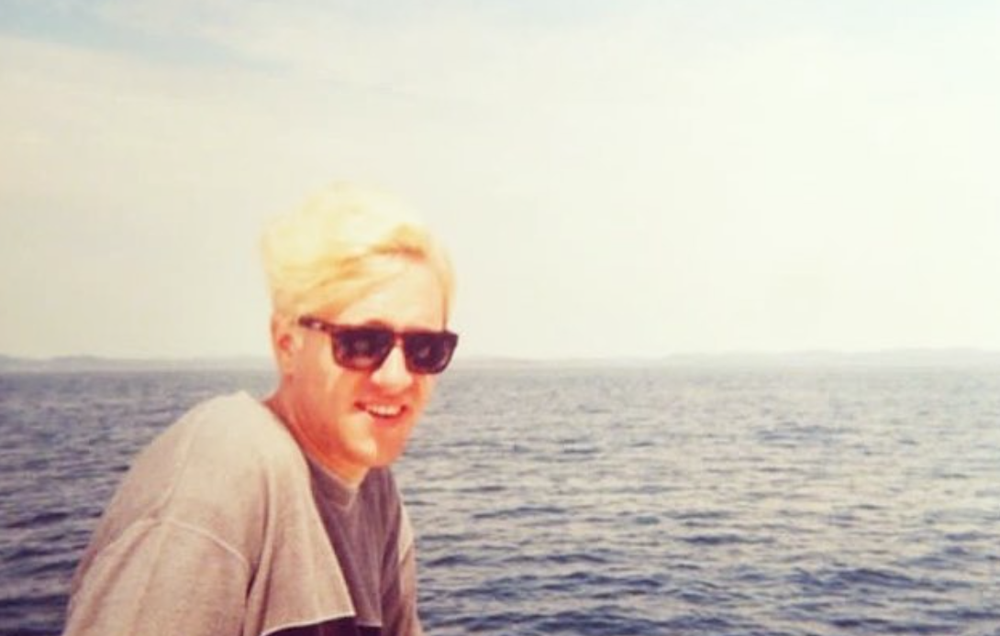
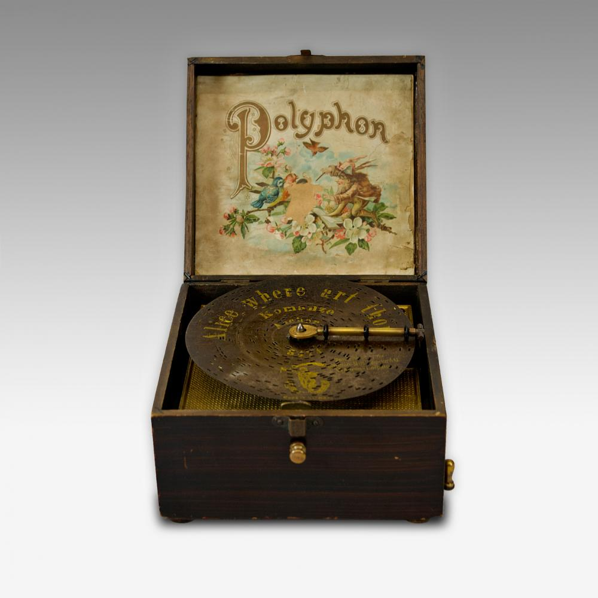
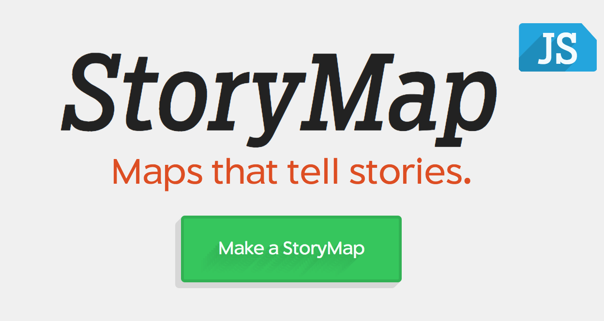

# **IASC 2P02** | Bennett Wiens

## Bio

Currently a student at Brock University in the Interactive Arts and Science program. Artist and musician looking to expand my knowledge in design and digital media. I've been playing drums for eight years and guitar for four. My whole life I have been drawing and creating art. I have recently begun filming and editing videos for my YouTube channel. In my two years at Brock I've learned and gained experience in commuter applications such as, Adobe Photoshop, Adobe Illustrator, Adobe Premiere, Maya, and a few others. I've also worked with coding languages including HTML, python, and CSS. In learning these tools I have opened new doors and have been able to experiment with my skills and knowledge of design, art, and digital media.

## Featured Project: The Polyphon Music Box

I made a short presentation on The Polyphon music box. This tech was current durring the late 1800's and early 1900's. 

Here is how my research evolved over time. I made these changes, which you can see [here](https://github.com/bewiens/IASC-2P02/commit/10d08dee06813071489d560d07f755f0b1553f85#diff-e95c7dc8eefee7d0e25121cd7f0007ae)
I also made changes [here](https://github.com/bewiens/IASC-2P02/commit/654fba624e495dcabd6c2015fa958715c6cd6d38#diff-e95c7dc8eefee7d0e25121cd7f0007ae)
I also made changes [here](https://github.com/bewiens/IASC-2P02/commit/1da3439af4e5db0811cbf4a10673817e78c99e9f#diff-e95c7dc8eefee7d0e25121cd7f0007ae)

View [The Polyphon music box](https://bewiens.github.io/IASC-2P02/reveal/index.html)

## Collabrabortive Project: StoryMapsJS

 

As a team we presented on the mapping tool StoryMapsJS. We divided up the workload evenly. I was given the task of introducing and giving a quick overview of the basics of StoryMapsJS.

**StoryMapJS: what I contributed to the team seen below:**

**Project introduction/overview:** 

What are the main goals of StoryMapJS?

StoryMap is essentially a mapping environment. It is a free online storytelling tool used for mapping and locating a story’s main events.

What are the main features? Show us how to use the tool. 

“There are a couple ways you can make a Story Map.”

Maps - “Add a slide for each place in your story. Setting the location is as easy as a text search for the name, address, or latitude and longitude. You can change the visual style of your map with a few presets, or you can use Mapbox to create your own style.”

Really big images - “You can tell stories with large photographs, works of art, historic maps, and other image files. Because it works best with pixel-dense files, we call these gigapixel. Setting one up requires you to host files on a web server.”

Media sources - “StoryMapJS can pull in media from a variety of sources. Twitter, Flickr, YouTube, Vimeo, Vine, Dailymotion, Google Maps, Wikipedia, SoundCloud, Document Cloud and more!”

Where is StoryMapJS located?

Northwestern University
“The Northwestern University Knight Lab is a team of technologists and journalists working at advancing news media innovation through exploration and experimentation.” The Knight Lab team works on StoryMap and similar online tools.

StoryMapJS funding.

Knight Foundation, Robert R. McCormick Foundation (both associated with Northwestern University)

## Academic Blog

A discussion on text analysis and Ramsay --> [continue reading](https://bewiens.github.io/IASC-2P02/blog.md)
